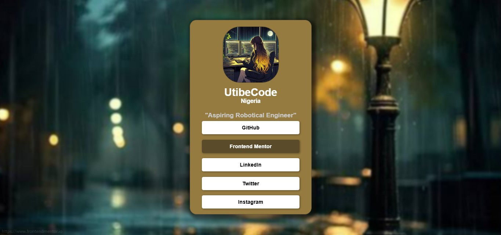

# Frontend Mentor - Social links profile solution

This is a solution to the [Social links profile challenge on Frontend Mentor](https://www.frontendmentor.io/challenges/social-links-profile-UG32l9m6dQ)

## Table of contents

- [Overview](#overview)
  - [The challenge](#the-challenge)
  - [Screenshot](#screenshot)
  - [Links](#links)
  - [Built with](#built-with)
  - [AI Collaboration](#ai-collaboration)
- [Author](#author)

## Overview
This is a design of a social-link profile. It shows the profile picture and also gives the links to the individual's social page

### The challenge

Users should be able to:

- See hover and focus states for all interactive elements on the page

### Screenshot

### Links

- Solution URL: [Add solution URL here](https://your-solution-url.com)
- Live Site URL: [Add live site URL here](https://your-live-site-url.com)

### Built with

- Semantic HTML5 markup
- CSS custom properties
- Flexbox
- CSS Grid

### AI Collaboration

During coding, I made use of VS chat AI. It really helped as it could access my code and easily make corrections.

## Author
- Website - [Utibe](https://utibecode.github.io/Social-links-profile/)
- Frontend Mentor - [@utibe](https://www.frontendmentor.io/profile/UtibeCode)
